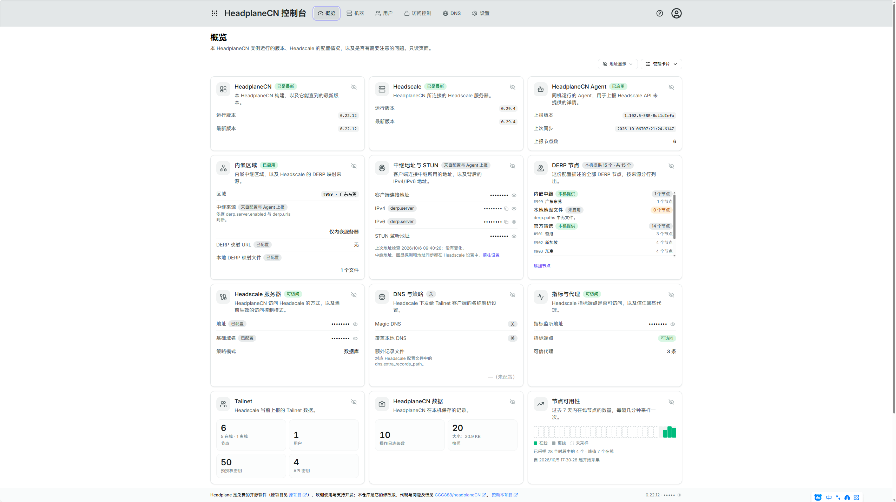
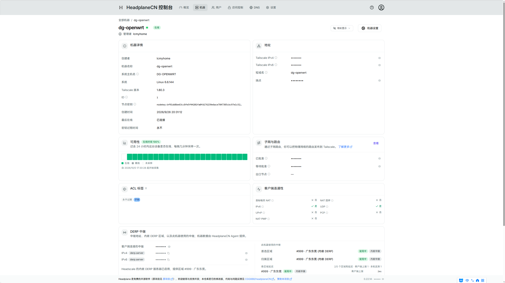

# Headplane

> 一个功能完整的 [Headscale](https://headscale.net) Web 管理界面
>
> **本仓库在原版基础上新增了完整的三语界面（English / 简体中文 / 繁體中文）与一系列兼容性修复**，
> 在「飞牛 fnOS（fpk 原生 headscale）+ Lucky 反向代理」这类部署下开箱可用。

> **快速入口**：
> [**📦 fnOS 完整安装说明**](./docs/install/fnos.md)（含 `config.yaml` 与 `docker-compose.yml` 全文）
> · [🌏 多语言 / 翻译指南](./docs/features/languages.md)
> · [🔧 常见问题排查](./docs/configuration/common-issues.md)
> · [📝 变更日志](./CHANGELOG.md)


## 中文说明

### 这是什么

Headscale 是 Tailscale 的开源自托管控制端（基于 WireGuard），官方**不带** Web 界面。
Headplane 给它补上前端：管理机器、用户、访问控制（ACL）、DNS 与 Headscale 设置。



### 本仓库相对原版做了什么

| 版本       | 内容                                                                                                                                                                                                                                                                             |
| ---------- | -------------------------------------------------------------------------------------------------------------------------------------------------------------------------------------------------------------------------------------------------------------------------------- |
| **0.8.0**  | **完整三语界面**：切换菜单、`locale` cookie、`Accept-Language` 自动匹配；登录页、错误页、权限提示、对话框、表格全部本地化                                                                                                                                                        |
| 0.8.1      | 修复「切换语言/配色报 Unexpected Server Error」：切换改走 GET，不再依赖 POST 请求体                                                                                                                                                                                              |
| 0.8.2      | 修复「退出登录报错」：改为导航式退出；OIDC 单点登出失败不再阻断本地退出；拒绝跨站退出                                                                                                                                                                                            |
| 0.8.3      | 修复「所有表单保存报错」：反代剥掉 `Content-Type` 时自动补回，并在服务端日志中记录                                                                                                                                                                                               |
| 0.8.4      | 修复「保存/切换报 403 / Unexpected Server Error」：反代改写 `Host` 会触发 React Router 的 CSRF 校验，现在额外接受 `server.base_url` 声明的来源                                                                                                                                   |
| 0.8.5      | ACL 不可写（Headscale 为文件模式）时，给出中文可读的原因与解决办法                                                                                                                                                                                                               |
| **0.9.0**  | 新增 **Headscale API Key 管理页**、**节点到期时间可选具体日期**、**ACL 结构化编辑 `grants` / `autoApprovers` / `nodeAttrs`**、**Headscale 设置页**（完整 OIDC、`trusted_proxies`、`policy.mode` 切换）                                                                           |
| **0.10.0** | 新增 **机器批量操作**（批量打标签/设到期/改属主/删除）、**保存前策略校验**（展示 Headscale 原文报错）、**系统状态页**（版本与更新提示、8 项诊断、一键重载/重启）                                                                                                                 |
| **0.11.0** | 新增 **Headscale 高级配置**（默认节点有效期、临时节点回收、日志级别/格式、Taildrop/自动更新/logtail/更新检查开关）、**配置文件体检**（web 版 configtest，8 类检查）、**ACL 补全**（grant 的 `app`/`via`、`randomizeClientPort`、`postures`/`ipSets` 提示）、**DNS 记录导入导出** |
| **0.12.0** | 新增 **DERP 面板**（自定义 DERP map、内嵌 DERP 服务器、各机器所用区域与延迟）、**操作审计**（谁改了什么，`/settings/audit`）、**配置快照与一键回滚**（`/settings/snapshots`）；**修复**：容器看不到宿主目录时配置检查误报"目录不存在"，现改为"无法验证"并提示挂载                |
| **0.13.0** | **机器详情页新增 DERP 中继信息**（所属区域、是否走自建内嵌 DERP、各区域延迟，需 Agent）；**修复**：Agent 同步错误不再显示为 `[object Object]`                                                                                                                                    |
| **0.13.1** | **修复**：配置里的 API Key 被 Headscale 拒绝（401）时，Agent 页直接给出提示与跳转，而不是甩一段请求转储                                                                                                                                                                          |
| **0.14.0** | DERP 增强：**一键启用内嵌 DERP 服务器**预设、**区域名称手动映射**（外部区域不再只有 `#id`）、**内嵌服务器连通性提示**（UDP 3478 + Headscale HTTPS 端口）                                                                                                                         |
| **0.14.1** | **修复**：配置检查把"容器看不到的宿主目录"误判为"尚未创建/首次启动"（现统一为"无法检查"并提示挂载）                                                                                                                                                                              |
| **0.15.0** | **设置页全部改为「分组列表 + 右侧抽屉」**；DERP 预设支持**只使用自建内嵌中继**（`derp.urls: []`）并显示**当前默认中继来源**；新增 `derp.server.ipv4`/`ipv6`；文案对齐官方（私钥缺失会自动生成、`server_url` 必须 https、需 tcp/443 + udp/3478）                                  |
| **0.16.0** | 设置页导航**改为与顶部导航一致的横向 Tab**，内容多的分组用**展开/折叠**（不再右侧弹出，确认类操作回到居中对话框）；DERP 页显示**由 `server_url` 推导的对外中继端口**，并给出**反代检查清单**（转发 `/derp`、允许 Upgrade、HTTPS、udp/3478 直达）                                 |
| **0.17.0** | **设置区视觉打磨**：统一页面外壳（标题/说明/通知）、**分段式 Tab 导航**（窄屏可横向滚动）、折叠卡片带**图标与状态徽标**（OIDC 是否配置、策略模式、可信代理数量、内嵌中继状态、密钥数量、Agent 同步、快照体积、检查结果）、保存按钮统一右对齐，浅色/深色对比一致 |
| **0.17.1** | **设置总览页改为卡片网格**：图标 + 标题 + 一行说明、整卡即链接、按 Headscale / Headplane 分组；移除「设置页仍在建设中」占位文案 |
| **0.18.0** | 补完 Headscale 配置项：**`oidc.extra_params`**（IdP 附加参数）、**`oidc.client_secret_path`**（密钥走文件）、**HA 子网路由探测**（`node.routes.ha.*`，含官方校验规则）＋**只读概览**（监听地址、IP 段与分配策略、数据库、metrics/gRPC、unix socket、noise key、TLS/ACME）；**审计日志可导出 CSV/JSON**；系统状态新增**Headplane 自身更新提示**与 **Prometheus 指标面板**（节点/用户/DERP/策略/运行时长 + 原始文本回退） |
| **0.19.0** | 新增**「总览」页**（顶部导航第一项，`/overview`）：Headplane／Headscale／Agent 三方版本与更新提示、**内嵌 DERP 区域**（id、代码、名称、启用状态、中继来源、`derp.urls`/`paths` 数量），并把**推导出的对外 `host:port`** 与**配置的 `derp.server.ipv4`/`ipv6`/STUN 地址**并排对照，另有使用该区域的机器数与 **IPv6/STUN 告警**；服务事实（Headscale URL 与可达性、`base_domain`、策略模式、DNS 开关、额外记录文件、metrics 监听与可达性、可信代理数量）、计数（节点在线/离线、用户、预授权密钥、API Key、审计条数、快照数量与总体积）与**配置检查/诊断健康汇总**，全部只读、读不到就降级；**机器列表与机器详情页视觉重做**（清晰主列 + 常驻状态点与徽标、随窗口变宽渐进出现的列、标签 chip、吸顶表头、区分「暂无机器」与「筛选无结果」的空状态、带数量的批量操作栏；详情页改为设置页风格头部 + 图标卡片与定义列表）；DERP 文案支持 **IPv6**（`0.0.0.0:3478` 仅 IPv4、`[::]:3478` 为双栈、Headscale 自身 `listen_addr` 同理） |
| **0.20.0** | **新增告警通知**（Webhook：Headscale 失联/恢复、节点掉线/恢复、密钥即将过期、配置检查失败；含冷却、投递历史与测试按钮）；**机器详情页**详情卡置顶、DERP 中继卡并入同一卡片网格；**概述页卡片统一美化**（图标块、状态徽标、定义列表、数字磁贴、逐项 pass/warn/fail） |
| **0.21.0** | **节点在线历史**（7 天稀疏采样；机器详情 24h 可用性条 + 概述页全量趋势；采集中断显示为"未知"）；**OIDC 登录自检**（9 项真实检查 + 汇总）；**Headplane 自身数据备份下载**（一致的 SQLite 副本并写明不含什么）；**中继卡片显示按域名实际解析的 A/AAAA 地址**；顶部品牌改为 **Headplane 控制台** |
| **0.21.1** | **Agent 页信息补全**（同步覆盖卡：已上报/全网节点数、最新与最早上报时间、最多 20 个节点的版本/系统/更新时间表；运行参数卡：可执行文件、工作目录、缓存 TTL、netns 模式、tailscaled 状态；绝对同步时间 + 刷新节奏）；**过期密钥管理**（API 密钥页新增状态筛选与过期计数、过期/已用行说明"Headscale 不支持删除、过期即撤销"、支持**批量过期**并排除已过期项） |
| **0.21.2** | **中继 IPv6 就绪度自动判定**（新增 `configDerpIpv4/Ipv6Resolvable`：对比"配置声明地址"与"域名实际解析地址"，给出匹配/解析不到/无记录/无法检查四类结论，DERP 卡片同步显示结论与一行修法）；**客户端连通性卡片逐行说明来源**（IPv6 为节点自测，与 Headscale 无关，并指明该查什么）；**固化真实成因提示**：宿主 DNS 过滤 AAAA 时用 `dig @1.1.1.1` 对比本机 `dig`，改宿主 DNS 并重启（负缓存 5 分钟） |
| **0.21.4** | **修复整站自动刷新**：实时更新的变更判定改为稳定投影（忽略 `last_seen` 等自变字段）+ 突发合并为 20 秒一次 + 后台巡检不再唤醒事件流；**实时更新默认关闭**，可在用户菜单里开启（记住选择）；输入框有焦点时不重载。另含 0.21.3 的热修内容 |
| **0.21.5** | **中继卡片显示"本次解析由谁回答"**（系统解析器 / 已配置的服务器列表）并在系统解析器对该地址族返回空时给出提示与设置入口；卡片上新增 **「重新解析」** 按钮（清缓存立即重查，无需等 5 分钟、无需进设置页） |
| **0.21.6** | **修复"点击即刷新"**：列表页写 URL（筛选/搜索/清空）触发的 loader 重跑已消除（机器列表与机器详情新增 `shouldRevalidate`，纯视图操作不再重取数据，真实导航与提交照旧重建）；ACL 页仅"校验策略"按钮的提交也不再触发重校验 |
| **0.21.7** | **修复"分包丢失导致的整页重载死循环"**：HTML 外壳改为 `Cache-Control: no-store`（哈希资源仍长缓存、数据与事件流不受影响）；新增守卫 —— 分包加载失败最多自动重载一次，仍失败则显示本地化说明与手动重载按钮，不再循环 |
| **0.21.8** | **修复 0.21.2 引入的"悬停/点击机器就整页重载"**：中继查询属服务端模块（Node DNS/日志），却被拉进浏览器 bundle → 路由模块求值失败触发重载；现改为由 loader 准备纯数据传给客户端，并移除内部链接的悬停预取。浏览器实测：悬停零请求、点击为应用内跳转 |

### 界面语言

| 语言     | 标识      |
| -------- | --------- |
| English  | `en`      |
| 简体中文 | `zh-Hans` |
| 繁體中文 | `zh-Hant` |

- **切换位置**：登录后点右上角**头像菜单**里的语言项；未登录时点**登录页右上角的地球按钮**。
- **生效方式**：选择写入 `locale` cookie 并由**服务端渲染** → 页头、表格、对话框、登录页、404 与权限错误提示全部跟随；时间格式也跟随所选语言。
- **首次访问**：读取浏览器 `Accept-Language` 自动匹配（`zh-TW` / `zh-HK` / `zh-MO` → 繁體中文，其余中文 → 简体中文），匹配不到时用英文。
- **词条位置**：`app/i18n/locales`；术语表、新增语言的完整步骤与自动化检查见 [多语言文档](./docs/features/languages.md)。

### 功能一览

- **机器管理**：过期时间、路由/子网、改名、转移与重新分配所有者、标签
- **访问控制**：ACL 规则、SSH 规则、主机、标签与组（**需 Headscale 使用 `policy.mode: database`**，文件模式下只能查看）
- **用户与预授权密钥**管理
- **DNS 与 Headscale 设置**编辑（**需把 Headscale 的 `config.yaml` 读写挂载给 Headplane**）
- **OIDC 单点登录**、**代理认证**（`server.proxy_auth`）
- **浏览器 SSH**（需 Agent 集成 + 目标节点 `tailscale up --ssh` + **OIDC 登录**）
- 不含 VNC / RDP：如需网页版，可另外部署 [headscale-console](https://github.com/rickli-cloud/headscale-console) 或 Apache Guacamole



### 部署

官方安装文档：<https://headplane.net>　本仓库镜像：

> **飞牛 fnOS（fpk 原生 headscale + Lucky 反代）的完整安装说明，见 [docs/install/fnos.md](./docs/install/fnos.md)** —— 含两份可直接使用的设置文件（`config.yaml` 与 `docker-compose.yml`）与全部常见问题排查。
>
> **注意**：fnOS 官方应用中心不提供 headscale，需先在应用中心添加第三方源 [github.com/conversun/fnos-store](https://github.com/conversun/fnos-store)，再安装 `headscale`（详见上面那份 fnOS 安装说明）。

```bash
docker pull ghcr.io/cgg888/headplane:latest
# 国内加速：docker pull v6.gh-proxy.org/docker/ghcr.io/cgg888/headplane:latest
```

**飞牛 fnOS（fpk 原生 headscale + Lucky 反代）关键三点**

1. **先确定 Headscale 的「生效配置」**：fnOS 上是 `/vol1/@appdata/headscale/config.yaml`
   （程序与 CLI 在 `/vol1/@appcenter/headscale/`，其启动脚本执行的是 `headscale serve --config <上面那份>`；
   `@appcenter/headscale/config/config.yaml` 只是**首次安装用的种子模板**，改了不生效）。
2. **Headplane 侧三件套**：`headscale.config_path` 指向容器内路径 + 把该配置**读写**挂进容器（如 `/etc/headscale/config.yaml`，**不要 `:ro`**）+ `server.base_url` 填浏览器访问的公网地址（如 `https://你的域名:8443`，**不带 `/admin`**）。
3. **想让网页能保存**：ACL 需 Headscale `policy.mode: database` 并**重启 headscale 进程**；DNS 与设置保存后要生效，需要 `integration.proc`（Headscale 为原生进程时）或容器化后的 `integration.docker`。

### 版本与镜像标签

采用语义化版本（自 v0.6.0）。本仓库由推送 git tag 触发构建，产物标签为
`x.y.z`、`latest`、`x.y.z-shell`（带 shell/curl 的调试镜像）。

### 安全提醒

- `server.cookie_secret` 必须是 32 字符并保密（`openssl rand -base64 24`）。
- Headscale 的 API Key 只在创建时显示一次；一旦泄漏，用
  `headscale apikeys expire --prefix <前缀>` 撤销后重建。
- 不要把 `/var/run/docker.sock` 随意挂进容器 —— 那等于把宿主机的 root 权限交给容器（本仓库文档中仅在内网场景建议，并推荐使用 socket-proxy）。

### 贡献

欢迎提交 issue 与 PR；规范见 [contributor guidelines](./docs/CONTRIBUTING.md)，文档站源码在 `docs/`。

---

## English

> A feature-complete web UI for [Headscale](https://headscale.net)

_Screenshots are shown in the Chinese section above._

Headscale is the de-facto self-hosted version of Tailscale, a popular Wireguard
based VPN service. By default, it does not ship with a web UI, which is where
Headplane comes in. Headplane is a feature-complete web UI for Headscale, allowing
you to manage your nodes, networks, and ACLs with ease.

Headplane aims to replicate the functionality offered by the official Tailscale
product and dashboard, being one of the most feature complete Headscale UIs available.
These are some of the features that Headplane offers:

- Machine management, including expiry, network routing, name, and owner management
- Access Control List (ACL) and tagging configuration for ACL enforcement
- Support for OpenID Connect (OIDC) as a login provider
- The ability to edit DNS settings and automatically provision Headscale
- Configurability for Headscale's settings
- A language switcher for English, Simplified Chinese, and Traditional Chinese

### Languages

The interface ships in three languages and needs no configuration to use them:

| Locale    | Language                       |
| --------- | ------------------------------ |
| `en`      | English                        |
| `zh-Hans` | 简体中文 (Simplified Chinese)  |
| `zh-Hant` | 繁體中文 (Traditional Chinese) |

Pick a language from the account menu in the header, or from the globe button on
the login page. The choice is stored in a `locale` cookie and resolved on the
server, so the entire interface — including the login page, error pages, and
permission failures — renders in the selected language, and timestamps follow it
too. A first-time visitor is matched against the browser's `Accept-Language`
header before falling back to English.

Translations live in `app/i18n/locales`. Adding a locale means adding a catalog,
registering it in `app/i18n/index.ts` and `app/utils/locale.ts`, then running the
unit tests, which assert that every catalog defines the same key space, keeps the
placeholders aligned, and that Traditional Chinese contains no simplified
characters. See the [language documentation](./docs/features/languages.md) for
the glossary and the full contributor guide.

Headscale API errors, server logs, and internal validation messages stay in
English because the UI does not produce them.

### Deployment

Refer to the [website](https://headplane.net) for detailed installation instructions.
A step-by-step guide for fnOS (native Headscale + Docker) is available at
[docs/install/fnos.md](./docs/install/fnos.md).

### Versioning

Headplane uses [semantic versioning](https://semver.org/) for its releases (since v0.6.0).
Pre-release builds are available under the `next` tag and get updated when a new release
PR is opened and actively in testing.

### Contributing

Headplane is an open-source project and contributions are welcome! If you have
any suggestions, bug reports, or feature requests, please open an issue. Also
refer to the [contributor guidelines](./docs/CONTRIBUTING.md) for more info.

---

> Copyright (c) 2025 Aarnav Tale
