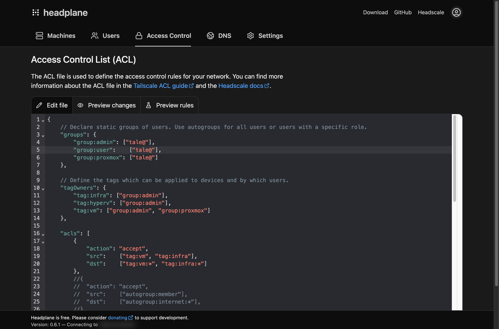

# Headplane

> A feature-complete web UI for [Headscale](https://headscale.net)

<picture>
    <source
        media="(prefers-color-scheme: dark)"
        srcset="./docs/assets/preview-dark.png"
    >
    <source
        media="(prefers-color-scheme: light)"
        srcset="./docs/assets/preview-light.png"
    >
    
</picture>

Headscale is the de-facto self-hosted version of Tailscale, a popular Wireguard
based VPN service. By default, it does not ship with a web UI, which is where
Headplane comes in. Headplane is a feature-complete web UI for Headscale, allowing
you to manage your nodes, networks, and ACLs with ease.

Headplane aims to replicate the functionality offered by the official Tailscale
product and dashboard, being one of the most feature complete Headscale UIs available.
These are some of the features that Headplane offers:

- Machine management, including expiry, network routing, name, and owner management
- Access Control List (ACL) and tagging configuration for ACL enforcement
- Support for OpenID Connect (OIDC) as a login provider
- The ability to edit DNS settings and automatically provision Headscale
- Configurability for Headscale's settings
- A language switcher for English, Simplified Chinese, and Traditional Chinese

## Languages

The interface ships in three languages and needs no configuration to use them:

| Locale    | Language                       |
| --------- | ------------------------------ |
| `en`      | English                        |
| `zh-Hans` | 简体中文 (Simplified Chinese)  |
| `zh-Hant` | 繁體中文 (Traditional Chinese) |

Pick a language from the account menu in the header, or from the globe button on
the login page. The choice is stored in a `locale` cookie and resolved on the
server, so the entire interface — including the login page, error pages, and
permission failures — renders in the selected language, and timestamps follow it
too. A first-time visitor is matched against the browser's `Accept-Language`
header before falling back to English.

Translations live in `app/i18n/locales`. Adding a locale means adding a catalog,
registering it in `app/i18n/index.ts` and `app/utils/locale.ts`, then running the
unit tests, which assert that every catalog defines the same key space, keeps the
placeholders aligned, and that Traditional Chinese contains no simplified
characters. See the [language documentation](./docs/features/languages.md) for
the glossary and the full contributor guide.

Headscale API errors, server logs, and internal validation messages stay in
English because the UI does not produce them.

## Deployment

Refer to the [website](https://headplane.net) for detailed installation instructions.

## Versioning

Headplane uses [semantic versioning](https://semver.org/) for its releases (since v0.6.0).
Pre-release builds are available under the `next` tag and get updated when a new release
PR is opened and actively in testing.

## Contributing

Headplane is an open-source project and contributions are welcome! If you have
any suggestions, bug reports, or feature requests, please open an issue. Also
refer to the [contributor guidelines](./docs/CONTRIBUTING.md) for more info.

---

<picture>
    <source
        media="(prefers-color-scheme: dark)"
        srcset="./docs/assets/acls-dark.png"
    >
    <source
        media="(prefers-color-scheme: light)"
        srcset="./docs/assets/acls-light.png"
    >
    
</picture>

<picture>
    <source
        media="(prefers-color-scheme: dark)"
        srcset="./docs/assets/machine-dark.png"
    >
    <source
        media="(prefers-color-scheme: light)"
        srcset="./docs/assets/machine-light.png"
    >
    
</picture>

> Copyright (c) 2025 Aarnav Tale
