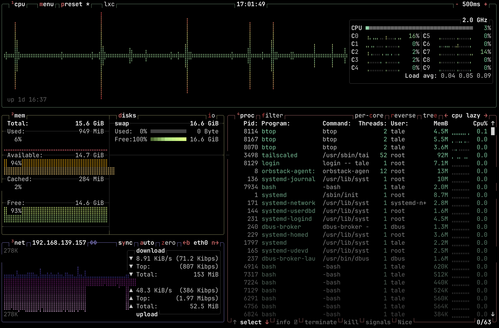
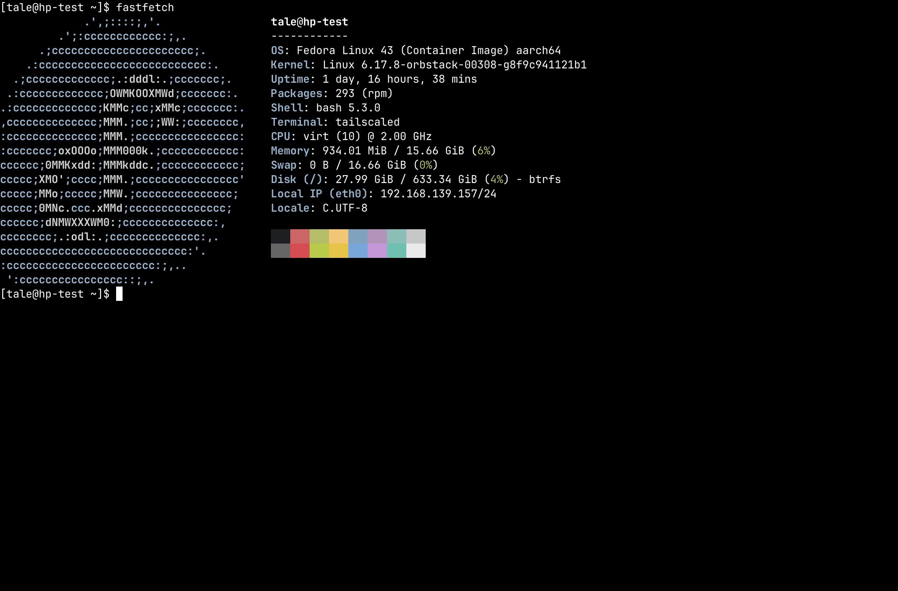

# 浏览器 SSH

<figure>
  
  <figcaption>通过浏览器 SSH 运行的 <code>btop</code></figcaption>
</figure>

浏览器 SSH 允许用户直接在浏览器中，对 Tailnet 内任何可达的节点发起 SSH 会话。它会临时拉起
一个加入 Tailnet 的临时 Tailscale 节点，仅在 SSH 会话期间存在。

<figure>
  
  <figcaption>带 Nerd Font 图标的 <code>fastfetch</code></figcaption>
</figure>

## 前置条件

- **需要 Headscale 0.28 或更新版本。** 浏览器 SSH 在 Headscale 0.29 beta 版到 0.29.1 之间
  无法使用；请使用 Headscale 0.28.x 或 0.29.2 及更新版本。
- 目标节点必须启用 **Tailscale SSH**（`tailscale up --ssh`）。
- 用户必须通过 **OIDC** 登录（使用 API Key 登录无法使用浏览器 SSH）。
- 必须[启用并配置](/features/agent) **Headplane Agent**。

:::warning Headscale 0.29.0 beta 至 0.29.1
由于 `/ts2021` 的 WebSocket 路由回归问题，浏览器 SSH 在 Headscale 0.29 beta 版到 0.29.1 之间
无法使用。这些版本会以 `405 Method Not Allowed` 拒绝 Tailscale 浏览器 / WASM 控制平面的
WebSocket 请求。请把 Headscale 升级到 0.29.2 或更新版本，或使用 Headscale 0.28.x。
:::

## 工作原理

:::tip
虽然我们用 Ghostty（借助 [restty](https://restty.pages.dev)）来渲染终端，但 SSH 连接使用的
`TERM` 值固定为 `xterm-256color`，以获得最好的兼容性。Nerd Font 字形开箱即用 —— 终端自带
自托管的 JetBrains Mono Nerd Font。
:::

当用户从界面打开 SSH 会话时，浏览器会：

1. 加载一个 WASM 模块，它使用用户态 WireGuard 运行一个最小化的 Tailscale 节点。该节点通过
   预授权密钥连接到 Tailnet。
2. 通过隧道对目标节点的 Tailscale IP 地址发起 SSH 会话，并把它交给浏览器。
3. 使用 [restty](https://restty.pages.dev)（基于 Ghostty 的 WASM 终端模拟器），浏览器渲染出
   一个功能完整的终端，并把 SSH 会话代理给它。

## 反向代理配置

浏览器 SSH 要求浏览器能够直接访问 **Headplane** 和 **Headscale**。如果其中任何一个位于反向
代理之后，代理必须配置为支持 WebSocket 连接 —— WASM 节点正是通过它与 DERP 中继服务器通信。

### 必需的请求头

你的反向代理必须为 Headscale 的 DERP 端点转发以下请求头：

| 请求头                   | 取值                                    |
| ------------------------ | --------------------------------------- |
| `Upgrade`                | `websocket`                             |
| `Connection`             | `Upgrade`                               |
| `Sec-WebSocket-Protocol` | 原样转发（Tailscale 使用的是 `derp`）   |

### CORS 请求头

Headscale 必须能从 Headplane 所在的源访问。如果 Headplane 与 Headscale 处于不同的源（主机或
端口不同），你的反向代理必须为 Headscale 的响应添加 CORS 请求头：

| 请求头                         | 取值                                            |
| ------------------------------ | ----------------------------------------------- |
| `Access-Control-Allow-Origin`  | 你的 Headplane 实例的源                         |
| `Access-Control-Allow-Methods` | `GET, POST, OPTIONS`                            |
| `Access-Control-Allow-Headers` | `Content-Type, Upgrade, Sec-WebSocket-Protocol` |

### 示例：Caddy

```caddyfile
# Headscale
hs.example.com {
    reverse_proxy localhost:8080

    # If Headplane is on a different origin:
    header Access-Control-Allow-Origin "https://headplane.example.com"
    header Access-Control-Allow-Methods "GET, POST, OPTIONS"
    header Access-Control-Allow-Headers "Content-Type, Upgrade, Sec-WebSocket-Protocol"
}
```

Caddy 会自动处理 WebSocket 升级，无需额外配置。

### 示例：nginx

```nginx
# Headscale
server {
    listen 443 ssl;
    server_name hs.example.com;

    location / {
        proxy_pass http://localhost:8080;
        proxy_http_version 1.1;
        proxy_set_header Upgrade $http_upgrade;
        proxy_set_header Connection "upgrade";
        proxy_set_header Host $host;

        # If Headplane is on a different origin:
        add_header Access-Control-Allow-Origin "https://headplane.example.com" always;
        add_header Access-Control-Allow-Methods "GET, POST, OPTIONS" always;
        add_header Access-Control-Allow-Headers "Content-Type, Upgrade, Sec-WebSocket-Protocol" always;
    }
}
```

### 同源部署

如果 Headplane 与 Headscale 共用同一个源（例如用一个反向代理把 `/admin` 路由到 Headplane，
其余全部路由到 Headscale），则不需要 CORS 请求头。但 WebSocket 升级转发仍然是必需的。

## 故障排查

### SSH 不可用

**Error:** "This version of Headplane was not built with browser SSH support."

WASM 资源（`hp_ssh.wasm` 和 `wasm_exec.js`）缺失。请用 `./build.sh --wasm` 重新构建，或确认
你的 Docker 镜像在构建时带了 `--wasm` 参数。

### 需要 Agent

**Error:** "Browser SSH is only available when the Headplane agent integration is enabled."

Headplane Agent 没有启用。浏览器 SSH 依赖 Agent 提供 Tailnet 连接和临时节点清理能力。搭建
方法见 [Agent 文档](/features/agent)。

### 需要 OIDC

**Error:** "Browser SSH is only available when OIDC authentication is enabled."

浏览器 SSH 需要 OIDC 认证来生成绑定到 Headscale 用户的预授权密钥。使用 API Key 登录时没有
关联的 Headscale 用户身份。请改用你配置好的 OIDC 提供方登录。

### 用户未关联

**Error:** "You'll need to link your user account to a Headscale user before you can use Browser SSH."

你的 OIDC 账号没有匹配到 Headscale 中的任何用户。使用浏览器 SSH 之前，你必须先通过 Headscale
认证至少一次，这样才会创建 Headscale 用户并与你的 OIDC 身份关联。

### 找不到节点

**Error:** "No node found with hostname ..."

URL 中的节点名与 Headscale 中注册的任何节点都不匹配。该节点可能已被重命名或删除。请返回机器
列表重试。

### 节点离线

Headplane 会在发起 SSH 会话之前检查目标节点是否已连接到 Tailnet。如果节点离线，你会看到一个
带有 **Retry Connection** 按钮的错误页。请确认节点正在运行并已连接到 Headscale，然后重试。

### 连接失败并返回 EOF 或卡住

- **检查 Headscale 版本。** 由于 `/ts2021` 的 WebSocket 路由回归问题，浏览器 SSH 在
  Headscale 0.29 beta 版到 0.29.1 之间无法使用。如果浏览器控制台对 `/ts2021` 显示
  `405 Method Not Allowed`，请升级到 Headscale 0.29.2 或更新版本，或使用 Headscale 0.28.x。
- **检查 Headscale 配置里的 `server_url`。** 如果 Headscale 运行在非标准端口上，`server_url`
  必须带上该端口（例如 `https://hs.example.com:8443`）。内嵌 DERP 服务器会据此推导对外公布
  的端口。**不要**把 DERP 端口写进 Headplane 的 `headscale.public_url` —— 那个设置只用于界面
  显示，改动它会破坏注册命令和授权密钥的提示。
- **确认反向代理支持 WebSocket。** Headscale 前面的代理必须转发 `Upgrade: websocket` 请求头。
  否则 DERP 连接会立即失败。
- **不同源时检查 CORS。** 打开浏览器控制台查看是否有 CORS 错误。如果 Headplane 与 Headscale
  处于不同的源，必须在 Headscale 的代理上配置 CORS 请求头。
- 确认目标节点已启用 Tailscale SSH（`tailscale up --ssh`）。
- 检查浏览器控制台中的 WASM 错误或 DERP 连接失败信息。

### "failed to look up local user \*"

当 Headscale SSH ACL 使用 `"users": ["*"]` 时，终端里会出现这个错误 —— 某些 Tailscale 版本
会把它当成字面用户名而不是通配符。要解决这个问题，请把 ACL 的 SSH 规则改为使用
`"autogroup:nonroot"` 或明确的用户名：

```jsonc
// Before (broken on some versions)
{ "action": "accept", "src": ["autogroup:member"], "dst": ["autogroup:self"], "users": ["*"] }

// After (recommended)
{ "action": "accept", "src": ["autogroup:member"], "dst": ["autogroup:self"], "users": ["autogroup:nonroot"] }
```

### 终端能打开但无法输入

- 确认目标节点的 Tailscale SSH ACL 允许该用户。SSH 在传输层可以连接成功，但会话可能被节点的
  SSH 策略拒绝。
- 检查你输入的用户名是否是目标节点上有效的 Linux 用户。如果用户不存在，SSH 会话看起来会
  连上，但会立即失败。

### "SSH error: ssh: handshake failed: ssh: no common algorithm"

目标节点的 SSH 服务器不支持 Go SSH 客户端提供的任何算法。这通常意味着目标节点运行着很旧或
很新的 OpenSSH，并且使用了非默认的算法配置。通常更新目标节点上的 Tailscale 即可解决。

### SSH 会话能连上但立即断开

- 目标节点可能没有安装或运行 SSH 服务器。Tailscale SSH（`tailscale up --ssh`）会运行自己的
  SSH 服务器；如果没有启用 Tailscale SSH，节点就需要一个监听 22 端口的标准 SSH 服务器
  （例如 `openssh-server`）。
- 节点上的防火墙可能拦住了 22 端口，即使对 Tailnet 内的连接也是如此。
