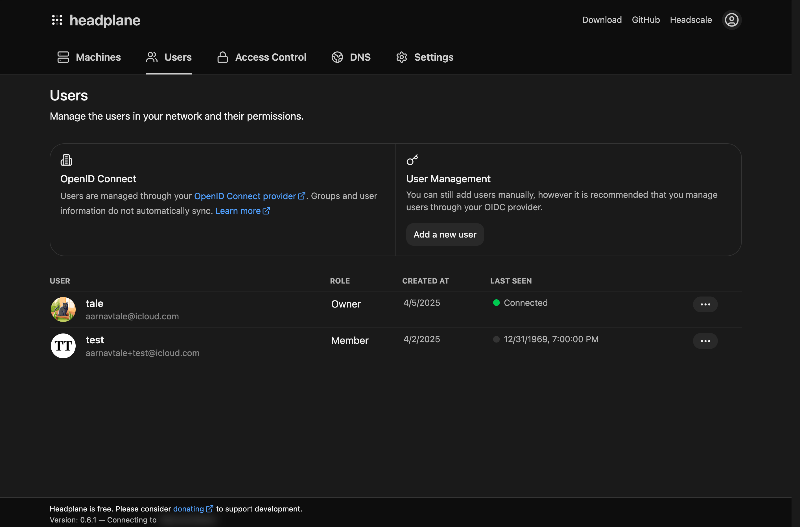
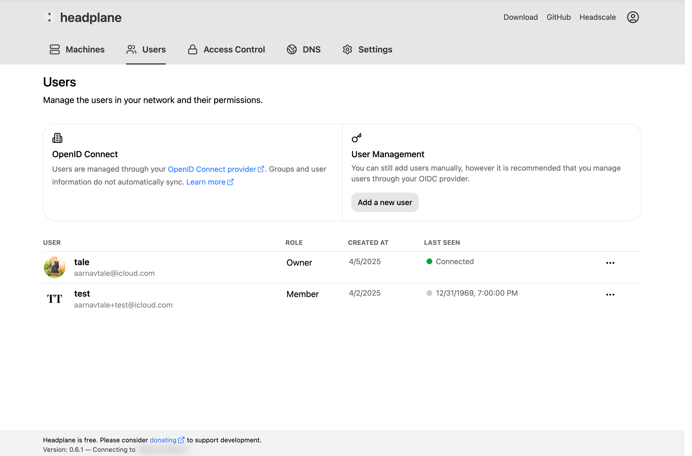

# 单点登录（SSO）

<figure>
    
    
    <figcaption>SSO 配置页面</figcaption>
</figure>

单点登录允许用户通过外部身份提供方（IdP）使用 OpenID Connect（OIDC）协议登录 HeadplaneCN。
启用后，用户通过你的 IdP 登录，HeadplaneCN 会自动把他们关联到对应的 Headscale 身份、分配角色
并管理其会话。

如果你的反向代理已经完成了认证，并能把可信的用户请求头传给 HeadplaneCN，请改看
[代理认证](./proxy-auth.md)。

## 快速开始

### 前置条件

开始之前你需要准备：

- 一套已经配置好、可以正常工作的 HeadplaneCN 安装。
- 一个支持 OAuth2 和 OpenID Connect（OIDC）的身份提供方（IdP）。
- 在配置文件中把 `server.base_url` 设置为 HeadplaneCN 实例的公开 URL（浏览器中可见的域名）。
- 一把有效期较长的 Headscale API 密钥（例如 1 年）。

### 配置客户端

你需要在身份提供方中创建一个客户端，供 HeadplaneCN 用于认证。在这一步中，你还需要注册一个
“重定向 URL” —— 也就是 IdP 在用户认证完成后把用户送回的位置。

对 HeadplaneCN 来说，重定向 URL 的格式如下（把域名替换成 `server.base_url` 的值）：

```
https://headplane.example.com/admin/oidc/callback
```

创建好客户端后，请记下以下内容：

- Client ID（客户端 ID）
- Client Secret（客户端密钥，如果适用）
- Issuer URL（签发方 URL）

### OIDC 配置

要在 HeadplaneCN 中启用 OIDC 认证，请在配置文件中加入以下内容：

```yaml
headscale:
  url: "http://headscale:8080"
  api_key: "<generated-api-key>"

oidc:
  issuer: "https://your-idp.com"
  client_id: "your-client-id"
  client_secret: "your-client-secret"
  # You can also provide the client secret via a file:
  # client_secret_path: "${HOME}/secrets/headplane_oidc_client_secret.txt"

  # These are usually auto-discovered, but can be set manually:
  # authorization_endpoint: ""
  # token_endpoint: ""
  # userinfo_endpoint: ""
  # jwks_endpoint: ""
  # scope: "openid email profile"
  # subject_claims: ["open_id", "email"]
  # default_role: "member"
  # role_claim: "headplane_role"
  # allow_weak_rsa_keys: false
  # extra_params:
  #  foo: "bar"
```

HeadplaneCN 会从签发方的 `/.well-known/openid-configuration` 自动发现 OIDC 端点。如果你的 IdP
不支持自动发现，则需要手动设置这些端点。

### 非标准 Subject 声明

有些提供方不会在 ID token 中返回标准的 OIDC `sub` 声明。HeadplaneCN 始终优先使用 `sub`，但你
可以通过 `oidc.subject_claims` 配置回退声明。

对于飞书 / Lark，推荐的配置是：

```yaml
oidc:
  subject_claims: ["open_id", "email"]
```

这样会优先使用 `open_id`、只在必要时回退到 `email`，从而让身份匹配保持稳定。

### 旧式弱 RSA 签名密钥

一些旧式提供方仍然使用小于 2048 位的 RSA 密钥签发 ID token，HeadplaneCN 默认会拒绝这类密钥。

如果你的提供方暂时无法轮换到更强的签名密钥，可以显式启用兼容回退：

```yaml
oidc:
  allow_weak_rsa_keys: true
```

::: warning
这会削弱 ID token 的验证安全性，只应作为临时手段，直到你的提供方轮换到 2048 位或更长的密钥。
:::

### PKCE

::: warning
HeadplaneCN 目前只支持 **`S256`** 这一种 PKCE code challenge 方法。你可能需要确认你的身份提供方
已配置为接受该方法。
:::

默认情况下 HeadplaneCN 不使用 PKCE（Proof Key for Code Exchange）。PKCE 是 OIDC 的最佳实践，
能提升安全性 —— 有些 IdP 甚至要求必须使用。要启用 PKCE：

```yaml
oidc:
  use_pkce: true
```

## 用户匹配如何工作

当用户通过 OIDC 登录时，HeadplaneCN 需要把他关联到对应的 Headscale 用户。这对于展示用户自己的
机器、自助预授权密钥和 WebSSH 等功能都很重要。

### 匹配策略

HeadplaneCN 使用两步匹配策略：

1. **Subject 匹配（主要方式）**：Headscale 会为每个 OIDC 用户保存 IdP 的 `provider_id`
   （例如 `https://idp.example.com/3d6f6e3f-...`）。HeadplaneCN 会取出其最后一段路径，与解析出的
   OIDC subject 比对。解析出的 subject 优先使用 `sub`，然后回退到任何已配置的
   `oidc.subject_claims`。如果两者一致，用户即被关联。

2. **邮箱匹配（回退方式）**：如果 subject 不匹配，HeadplaneCN 会退回到比较 OIDC `userinfo` 端点
   返回的用户邮箱与 Headscale 用户记录中保存的邮箱。

关联一旦建立，就会以 `headscale_user_id` 的形式保存在 HeadplaneCN 数据库中，之后的登录会复用
它 —— 因此匹配只需要成功一次。

### 未启用 OIDC 的 Headscale

如果你的 Headscale 实例使用的是**本地用户**（通过 `headscale users create` 创建）而不是
OIDC，那么自动匹配无法工作 —— 本地用户没有 `provider_id`，也没有可比较的邮箱。

在这种情况下，HeadplaneCN 会在新手引导过程中提示用户手动选择自己对应的 Headscale 用户。这个
选择会被持久化，因此只需要做一次。关联之后，所有基于归属关系的功能（查看自己的机器、自助
预授权密钥、WebSSH）都能正常工作。

::: tip
如果你在新手引导时跳过了用户选择，仍然可以使用 HeadplaneCN —— 只是没有基于归属关系的功能。
无论用户是否已关联，管理员都能管理一切。
:::

### 同一个客户端 vs 不同客户端

::: tip 推荐
Headscale 和 HeadplaneCN 使用**同一个 OIDC 客户端**是最简单、最可靠的方案。两个服务拿到的
`sub` 声明完全相同，因此 subject 匹配总能成功。
:::

如果你的 Headscale 和 HeadplaneCN 使用**不同的 OIDC 客户端**，有些身份提供方（尤其是 Azure AD /
Entra ID）可能会针对不同的客户端应用签发不同的 `sub` 值。在这种情况下：

- 首次登录时 subject 匹配会失败。
- HeadplaneCN 会回退到邮箱匹配，这要求你的 IdP 的 `userinfo` 端点与 Headscale 的用户记录中都有
  可用的 `email` 声明。
- 关联一旦建立，之后的登录都能正常工作，因为关联已经被持久化。

::: warning
如果你使用不同的客户端，**并且**你的 IdP 不提供 `email` 声明，HeadplaneCN 将无法把用户匹配到
他们的 Headscale 身份。用户仍然可以登录，但不会被关联到任何 Headscale 用户 —— 这意味着查看
自己的机器、自助预授权密钥等功能无法使用。
:::

## 角色与权限

启用 SSO 后，HeadplaneCN 使用基于角色的访问控制来决定每个用户在界面中能做什么。

### 可用角色

| 角色            | 说明                                                                                       |
| --------------- | ------------------------------------------------------------------------------------------ |
| **所有者**      | 拥有全部权限。不可被重新分配。第一个登录的用户会自动获得该角色。                            |
| **管理员**      | 除所有者专属标记外的全部权限。可以管理所有用户、机器、ACL、DNS 和设置。                     |
| **网络管理员**  | 可以管理 ACL、DNS 和网络设置。可以查看机器和用户。可以生成预授权密钥。                       |
| **IT 管理员**   | 可以管理机器、用户和功能设置。可以配置 IAM。不能修改 ACL 或 DNS。                            |
| **审计员**      | 对所有内容只有只读权限。可以生成自己的预授权密钥。                                          |
| **查看者**      | 可以查看机器和用户。可以生成自己的预授权密钥。                                              |
| **成员**        | 无界面访问权限。用户在 HeadplaneCN 数据库中存在，但未被授予任何权限。                          |

### 首次登录（Owner 引导）

第一个通过 OIDC 登录的用户会自动获得**所有者**角色。之后的所有用户默认获得**成员**角色
（无访问权限）。所有者或管理员需要随后在用户页面为他们分配合适的角色。

### 自动分配角色

你可以通过 `oidc.default_role` 修改新创建的 OIDC 用户所获得的角色：

```yaml
oidc:
  # Valid values: admin, network_admin, it_admin, auditor, viewer, member
  default_role: "viewer"
```

当 Headscale 已经按域名、组或用户限制了可认证范围时，这个设置很有用。例如，如果 Headscale
只允许 `@example.com` 用户登录，并且这些用户都应该能查看 HeadplaneCN，就设置
`default_role: "viewer"`。

如果想让 IdP 提供每个用户的角色，请把 `oidc.role_claim` 配置为包含 HeadplaneCN 角色的 OIDC
声明：

```yaml
oidc:
  role_claim: "headplane_role"
```

该声明可以是一个字符串，例如 `"admin"`，也可以是一个包含某个有效角色的数组。这让 Keycloak
之类的提供方可以在登录前把组或客户端角色映射为最终的 HeadplaneCN 角色。当同时配置了
`role_claim` 和 `default_role` 时，对新用户而言有效的角色声明优先。

对于 HeadplaneCN 中已存在的用户，每次 OIDC 登录时都会同步有效的 `role_claim`。如果他们的 IdP
组或客户端角色开始匹配另一个 HeadplaneCN 角色，他们的 HeadplaneCN 权限会在下次登录时更新。
`default_role` 只在创建用户时作为回退，不会覆盖已有角色。**所有者**角色保留给首次登录的
引导流程，不能被 `default_role` 或 `role_claim` 授予或覆盖。

### API Key 会话

使用 Headscale API 密钥（而不是 OIDC）登录的用户会被视为拥有全部权限。API Key 会话完全绕过
角色系统，因为持有 API 密钥本身就意味着拥有 Headscale 的管理权限。

### 新手引导

新的 OIDC 用户首次登录时会经过一个简短的新手引导流程，帮助他把第一台设备接入 Tailnet。这个
流程可以跳过。完成后，用户会进入主控制台。

## 单点登出（RP 发起的登出）

HeadplaneCN 支持
[OpenID Connect RP-Initiated Logout](https://openid.net/specs/openid-connect-rpinitiated-1_0.html)。
启用后，在 OIDC 会话中点击界面里的“退出登录”会：

1. 销毁本地的 HeadplaneCN 会话。
2. 把浏览器重定向到身份提供方的 `end_session_endpoint`。
3. 附带原始 `id_token` 作为 `id_token_hint`，并带上 `post_logout_redirect_uri`，以便 IdP
   在清理完自己的会话后把用户送回 HeadplaneCN。

### 配置

该功能**默认关闭**，因为 `post_logout_redirect_uri` 必须事先在 IdP 的 OIDC 客户端中注册。
未注册就启用，用户登出后会落到提供方的错误页。

要启用它，请设置 `oidc.use_end_session: true`：

```yaml
oidc:
  # Required: opt in to RP-initiated logout
  use_end_session: true

  # Optional: override the auto-discovered end_session_endpoint, or set it
  # manually if your provider does not expose it via discovery.
  # end_session_endpoint: "https://idp.example.com/realms/main/protocol/openid-connect/logout"

  # Optional. Defaults to `<server.base_url>/admin/login?s=logout`.
  # post_logout_redirect_uri: "https://headplane.example.com/admin/login?s=logout"
```

如果你的提供方在其发现文档中暴露了 `end_session_endpoint`（Keycloak、Authentik、Auth0、
Azure AD 等），只要 `use_end_session` 为 `true`，HeadplaneCN 就会自动采用它。

::: tip
请确认你提供的重定向 URI（或 HeadplaneCN 生成的默认值）已列入 IdP 客户端配置中的登出后 /
有效重定向 URI，否则提供方会拒绝跳回。
:::

当 `use_end_session` 为 `false`（默认值）时，HeadplaneCN 只是销毁自己的会话并把用户送回登录页。

## 故障排查

### 常见问题

- **“OIDC is not enabled or misconfigured”**：检查配置中是否存在 `oidc` 段，以及签发方 URL
  能否从 HeadplaneCN 服务器访问。

- **用户能登录但看不到自己的机器**：该用户的 Headscale 身份没有被匹配。检查是 `sub` 声明
  匹配上了，还是 `email` 声明可用（见[用户匹配如何工作](#用户匹配如何工作)）。

- **“Session cookie is empty”或登录循环**：检查你的 `cookie_secure` 设置。如果 HeadplaneCN 位于
  使用 HTTPS 的反向代理之后，请设为 `true`；如果是在没有 HTTPS 的环境下运行（例如本地开发），
  请设为 `false`。

- **Invalid API Key**：`headscale.api_key` 可能已过期。用
  `headscale apikeys create --expiration 999d` 生成一把新的。

- **缺少 `sub` 声明**：如果你的 IdP 不提供 `sub`，请把 `oidc.subject_claims` 配置为一个稳定的
  回退声明，例如 `open_id`。只有当 `email` 对你的用户足够稳定时，才把它用作回退。

- **Redirect URI Mismatch**：确认你在 IdP 中注册的重定向 URI 与
  `{server.base_url}/admin/oidc/callback` 完全一致。

- **PKCE 错误**：如果你的 IdP 要求 PKCE，请设置 `oidc.use_pkce: true`。如果错误信息里提到
  `code_verifier`，几乎总是这个原因。

- **缺少端点**：如果你的 IdP 不支持 OIDC 自动发现，你需要在配置中手动设置
  `authorization_endpoint`、`token_endpoint`、`userinfo_endpoint` 和 `jwks_endpoint`。
