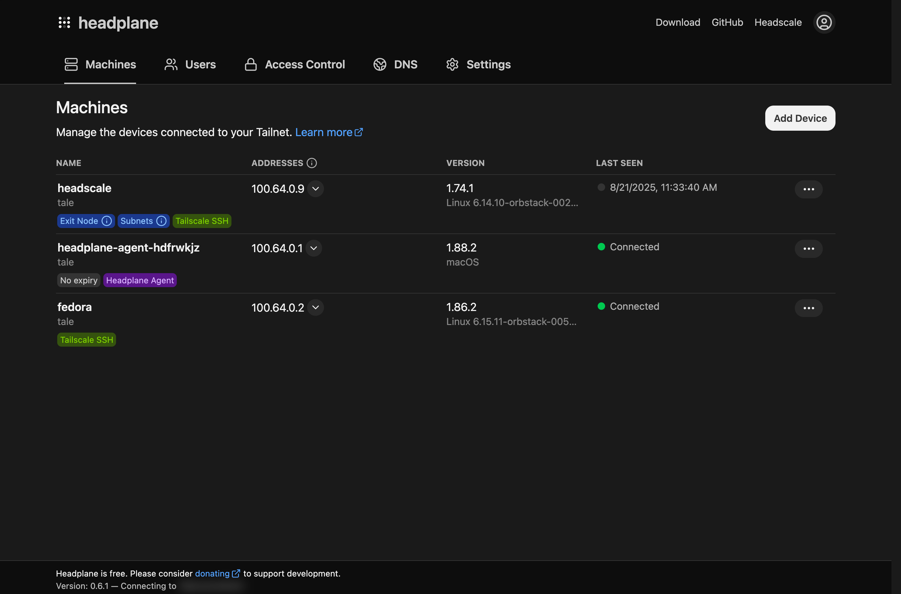
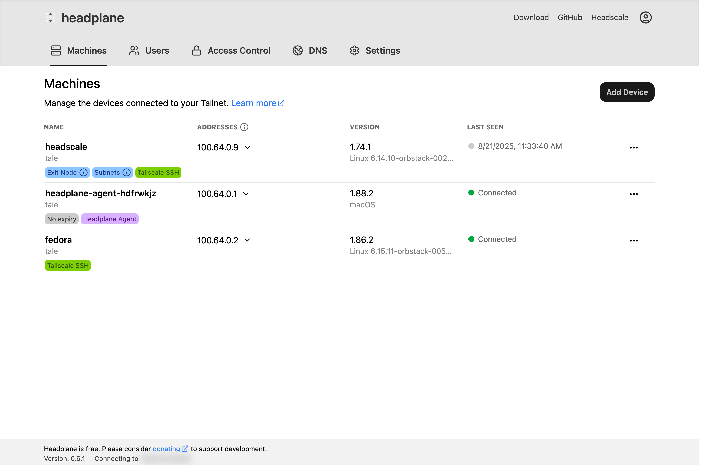
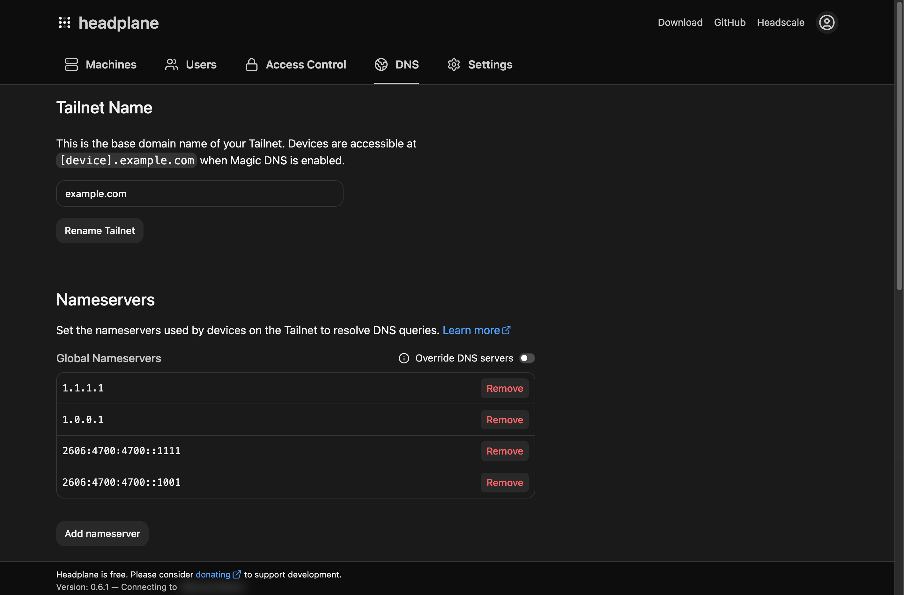
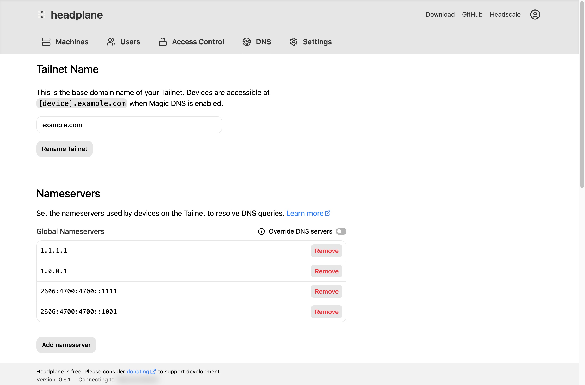
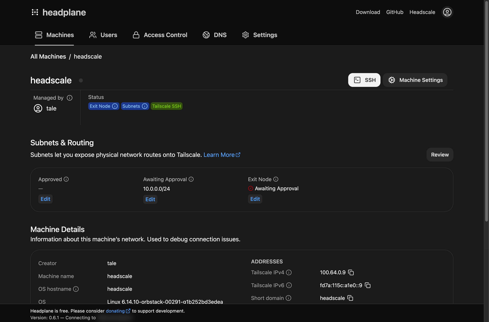
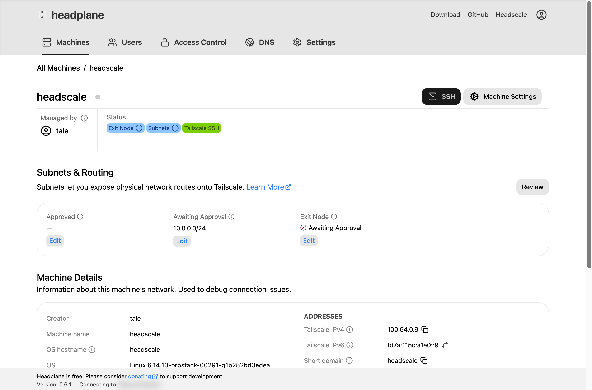

# HeadplaneCN（以及 Headscale）是什么？

HeadplaneCN 是一个 Web 界面，它把 Headscale 变成一个功能丰富的 VPN 平台，足以与 Tailscale 官方
产品相比。Headscale 是 Tailscale 控制服务器的自托管实现，让用户可以通过 Tailscale 客户端创建
并管理自己的私有 VPN 网络。

<figure>
    
    
    <figcaption>HeadplaneCN 看板</figcaption>
</figure>

Headscale 本身不带任何 Web 界面，HeadplaneCN 补上的正是这一块。它为你的 Headscale 实例提供一套
完整的管理界面，让你轻松管理节点、网络和 ACL。

它不止于基础管理功能，还提供诸如浏览器远程 SSH 访问节点、通过 OpenID Connect（OIDC）实现单点
登录（SSO），以及查看 Tailnet 配置与状态的详细信息。与其他 Headscale 界面相比，DNS 管理、ACL
编辑和 Headscale 配置都能直接在这个界面里完成。

<figure>
    
    
    <figcaption>HeadplaneCN 里的 DNS 管理</figcaption>
</figure>

HeadplaneCN 的目标是复刻 Tailscale 官方产品与控制台提供的能力，是目前功能最完整的 Headscale
界面之一。它提供的能力包括：

- 机器管理，涵盖有效期、网络路由、名称与所有者管理
- 访问控制列表（ACL）与标签配置，用于落实 ACL
- 支持 OpenID Connect（OIDC）作为登录方式
- 编辑 DNS 设置并自动配置 Headscale
- Headscale 各项设置的可视化配置

<figure>
    
    
    <figcaption>HeadplaneCN 里的机器管理</figcaption>
</figure>
