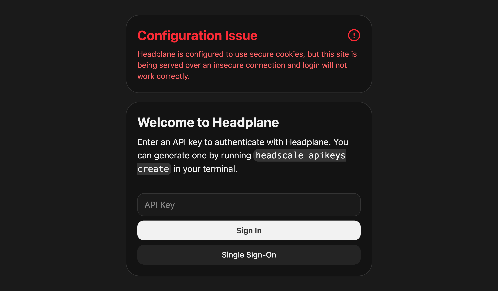

# 常见问题与解决办法

本文列出使用 Headplane 时可能遇到的一些常见问题，以及对应的解决办法。

## 登录没有反应

::: tip
Headplane 会尝试发现配置错误，并在登录页给出警告横幅。你可能会看到类似这样的提示：

<figure>
    
    
    <figcaption>登录警告横幅</figcaption>
</figure>
:::

如果你尝试登录 Headplane 但什么都没发生，原因可能是服务端 cookie 设置不对。请在 Headplane
配置里根据你的访问方式正确设置 `server.cookie_secure`：

- 通过 HTTPS 访问：`cookie_secure` 应启用（`true`）。
- 通过 HTTP 访问：`cookie_secure` 应关闭（`false`）。

## 保存时提示 "Unexpected Server Error"

如果登录正常，但**每一次**表单提交都失败（添加用户、创建预授权密钥、保存 ACL 策略、切换语言、
退出登录），那多半是 Headplane 前面的反向代理改写了 `Host` 头。

React Router 会拒绝任何 `Origin` 头与它从 `Host` 推导出的来源不一致的表单提交，这是针对跨站
请求伪造的防护。当代理终止 TLS 后用内部 `Host` 转发请求（例如用 `192.0.2.10:3000` 而不是
`headplane.example.com`），这个校验就会失败，而浏览器只会看到被清洗过的消息。服务端日志更
明确，会显示 `Error: Bad Request`。

从下面几种修复方式里选一种：

1. **告诉 Headplane 它的公网地址**（推荐）。把 `server.base_url` 设成你在浏览器里使用的 URL：

   ```yaml
   server:
     base_url: "https://headplane.example.com"
   ```

2. **列出允许提交表单的额外主机**，例如 `server.base_url` 必须保持内部地址时：

   ```yaml
   server:
     allowed_action_origins:
       - "headplane.example.com"
       - "headplane.example.com:8443"
   ```

3. **在反向代理里保留原始 `Host` 头**。对 nginx 来说是 `proxy_set_header Host $host;`，其他
   代理大多也有对应选项。

::: warning
不要添加通配符条目。这里列出的任何主机都能以已登录用户的身份提交操作。
:::

## 升级后提示「页面已过期」

Headplane 的客户端由带哈希的文件构成。当反向代理缓存了 HTML 文档时，浏览器里已有的旧页面会
继续载入一个引用着新版构建已不再提供的 chunk 文件的外壳。React Router 对无法载入的路由 chunk
的回应是重新加载文档，而这次加载又会拿到同一份被缓存的外壳，于是页面可能陷入循环。

Headplane 允许自己为此自动重载**一次**，把这次尝试记在 `sessionStorage` 里，然后就停下来：
下一次启动会显示 **页面已过期** 提示和一个 **重新加载页面** 按钮，而不是在同样的失败上再次
水合。按下按钮会忘记已记录的尝试，并再取一次文档。

根治要从两点入手：

- **强制刷新页面** —— `Ctrl+Shift+R`，macOS 上是 `Cmd+Shift+R` —— 绕过浏览器和代理缓存加载
  一次。代理已经拿到新构建时，这一步就够了。
- **不要让反向代理缓存 HTML 文档。** 只有 `/assets/` 下带哈希的文件适合长时间缓存；文档本身
  必须在每次导航时重新验证，否则升级很久之后仍在提供旧构建的外壳。
